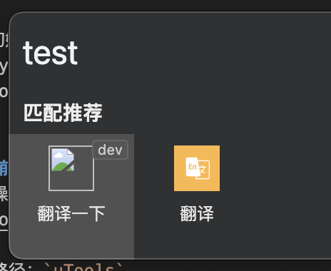
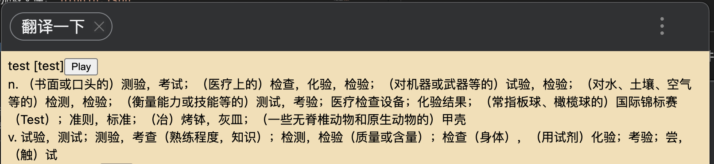
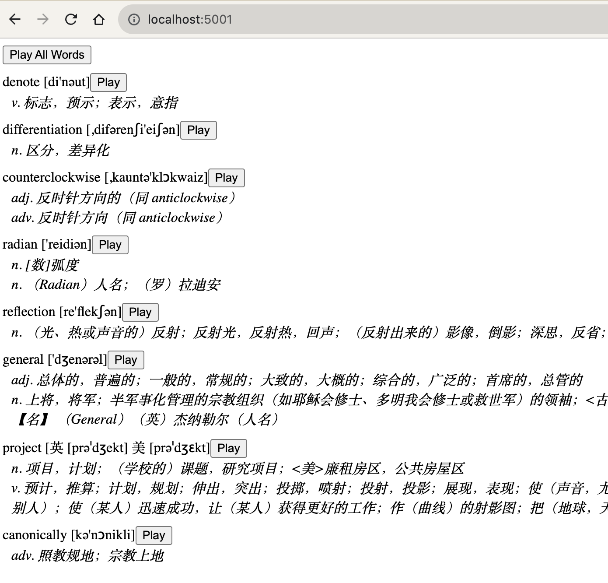

# 应用名称

本应用是一个单词本，可用来查单词、记单词、复习单词。
包含两个组件：python 编写的后端程序和 uTools 插件作为前端 UI。
单词翻译使用的是有道词典 API。

## 安装

### 后端 server
1. 安装 python 依赖
```python
pip install -r requirements.txt
```
2. 初始化 db
```python
python init_db.py
```

3. 启动 server
```python
python translator.py
```

### 前端插件
详细操作步骤见： https://www.u.tools/docs/developer/welcome.html

插件路径：`uTools`

只需要加载文件：`plugin.json`


## 使用

### 查单词
1. 在 uTools UI 中输入单词会自动匹配该插件



2. 点击空格激活插件

3. 查看单词翻译，并点击按钮播放发音



### 复习单词
1. 在浏览器输入网址: https://xxx/，页面会自动加载最近一天学习的单词列表，并且可以播放全部单词




